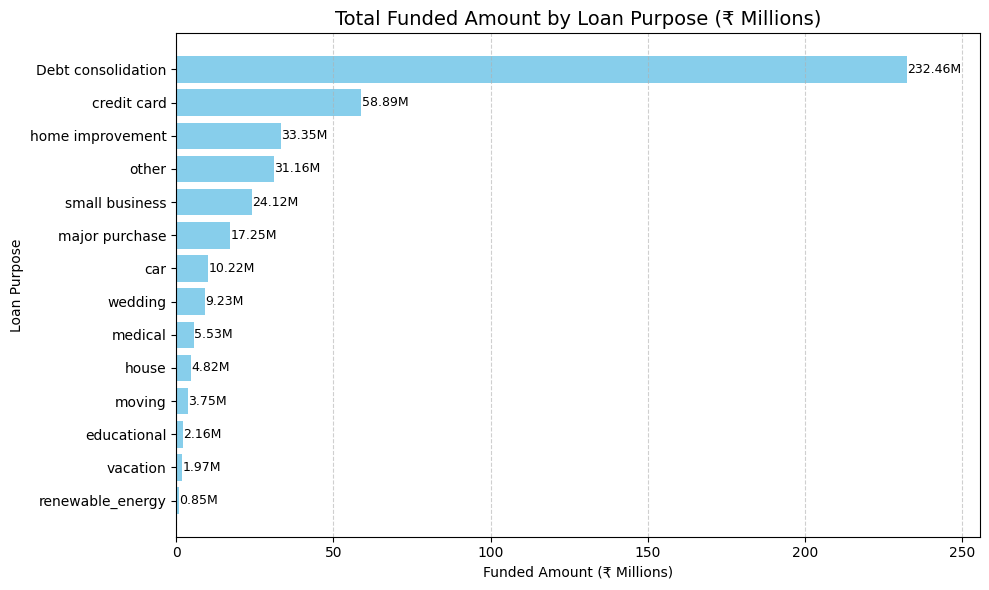
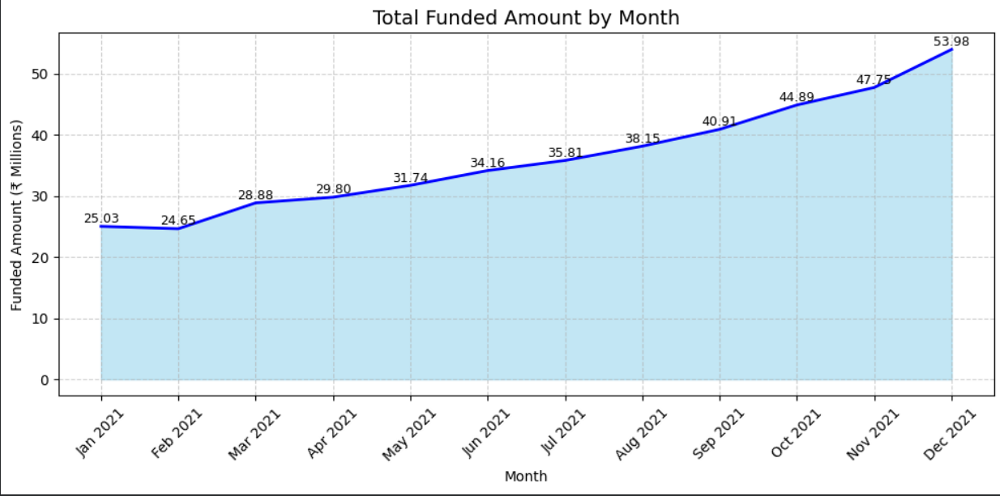
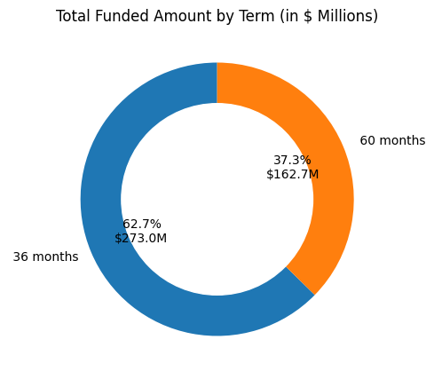

# Financial Loan Data Analysis (EDA) | Python Project

This project performs **Exploratory Data Analysis (EDA)** on a **Financial Loan dataset** using **Python**.  
The goal is to understand loan distribution, customer demographics, default patterns, and key financial factors that influence loan approval and risk.

This analysis helps identify trends and insights that can support **credit risk assessment and data-driven lending decisions**.

---

## 📊 Sample Visualizations

> 📌 Below are key visual insights generated during the EDA process

---

## 📂 Dataset Overview

The dataset contains financial and demographic details of loan applicants, including:

- **Loan ID**
- **Loan Amount**
- **Interest Rate**
- **Loan Term**
- **Loan Status** (Approved / Rejected / Default)
- **Applicant Income**
- **Credit Score**
- **Employment Status**
- **Debt-to-Income Ratio**
- **Purpose of Loan**

Dataset file:
- `financial_loan.xlsx`

---

## 🛠 Tools & Libraries Used

| Tool / Library | Purpose |
|--------------|--------|
| **Python** | Data analysis |
| **Pandas** | Data manipulation |
| **NumPy** | Numerical operations |
| **Matplotlib** | Data visualization |
| **Seaborn** | Statistical plots |
| **Jupyter Notebook** | EDA execution |

---

## 🔄 Steps Performed

1. **Data Loading & Inspection**
   - Loaded dataset from Excel
   - Checked data types, null values, and duplicates

2. **Data Cleaning**
   - Handled missing values
   - Removed inconsistencies
   - Converted data into suitable formats

3. **Exploratory Data Analysis**
   - Loan status distribution
   - Loan amount and income distribution
   - Credit score analysis
   - Relationship between income, loan amount, and default risk

4. **Visualization & Insights**
   - Used bar charts, histograms, box plots, and scatter plots
   - Identified key patterns affecting loan approval and default

---

## 📈 Key Insights

- Higher **credit scores** are strongly associated with loan approvals
- Applicants with **higher income** tend to take larger loan amounts
- **Default rates** are higher in low credit score segments
- Certain loan purposes show higher risk compared to others
- Income-to-loan imbalance increases default probability

---

## 🧠 Business Takeaways

- Strengthening **credit score thresholds** can reduce defaults
- Risk-based interest rates should be applied for low-score applicants
- Loan approvals should consider **income-to-loan ratio**
- Targeted monitoring is required for high-risk loan purposes

---

## 📦 Project Files

- `Financial_loan.ipynb` – Python EDA notebook  
- `financial_loan.xlsx` – Dataset  
- `images/` – Folder containing EDA visualizations  
- `README.md` – Project documentation  

---

## 🚀 Future Enhancements

- Build a **loan default prediction model**
- Perform feature engineering and correlation analysis
- Apply **machine learning classification models**
- Create an interactive dashboard using **Streamlit or Power BI**

---

⭐ If you find this project useful, feel free to **star the repository**!
